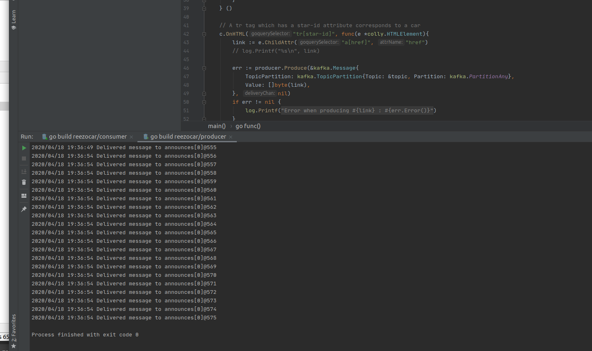
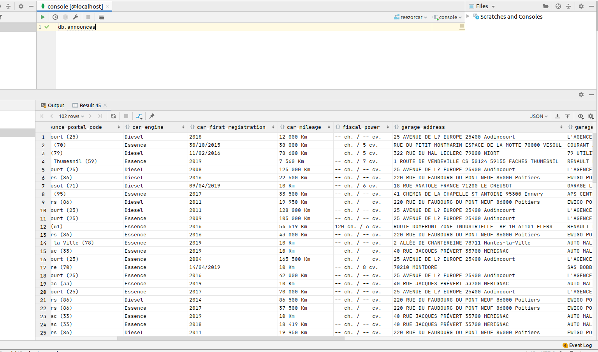

# reezocar_test

### Prerequisite

- GoLang 1.13
- Kafka 2.5.0
- Go Colly scrapper library
- Docker

### Initialisation

A) Create an _Announces_ Kafka topic :
 - `./kafka-topics.sh --create --bootstrap-server localhost:9092 --replication-factor 1 --partitions 1 --topic announces`

B) Use following Docker commands to run a MongoDB container :
 - Create a volume to persist data `docker volume create announces-volume`
 - Run MongoDB image `docker run --name announces-mongodb -v announces-volume:/data/db -p 27017:27017 -d mongo` (for the sake of the POC we use no auth. We could have set environment variables _MONGO_INITDB_ROOT_USERNAME_ and _MONGO_INITDB_ROOT_PASSWORD_ to set credentials)
 
C) Download Go Colly and MongoDB libraries :
 - `go get -u github.com/gocolly/colly/...`
 - `go get -u go.mongodb.org/mongo-driver/mongo`
 
D) Run consumer and producer

### Screenshots

Producer : 

Consumer (log message hidden by default) :

MongoDB announces collection :

### Areas for improvment

- Better parsing of announces fields (for instance, *fiscal_power* field contains actually horse power + fiscal power separated by a "/", car mileage could be formatted to int ("120 000km" to "120000"), etc..)
- When scanning a lot of pages (15+/20+ pages), there could sometimes be a client timeout error which must be handled
- Avoid duplicates : can be easily done by overriding MongoDB's *_id* field with the announce ID 

